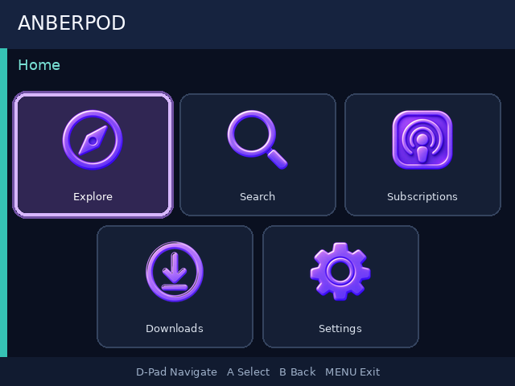
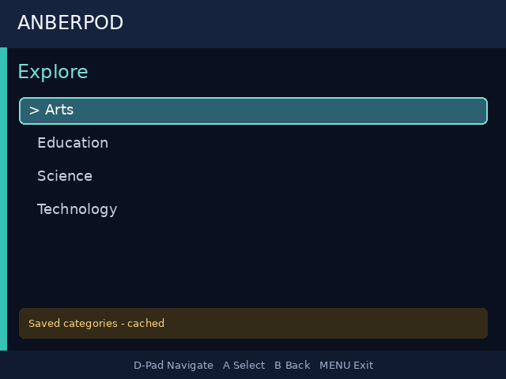
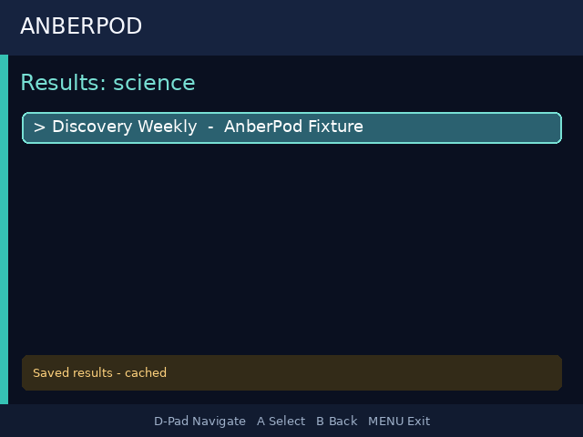
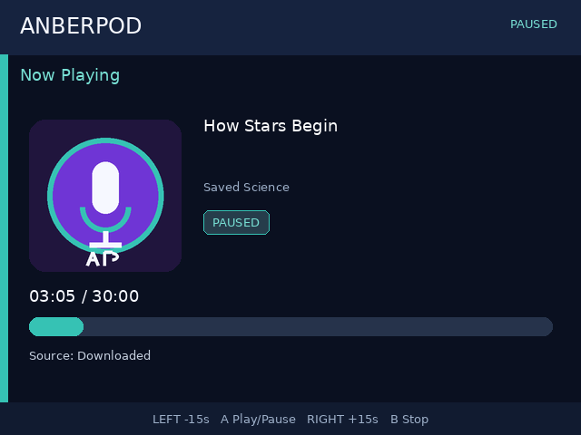
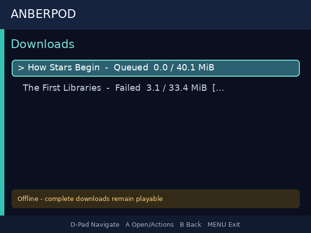

# AnberPod

A native podcast player for the Anbernic RG35XX H (MuOS firmware) — discover,
subscribe, stream, and download podcasts with fully physical-button control,
no on-device keyboard required.



## Features

- **Discover** — browse podcast categories or search by keyword. Works out
  of the box using the free, keyless iTunes Search API; if you configure a
  [Podcast Index](https://api.podcastindex.org/signup) API key, that richer
  catalog is used instead.
- **Direct RSS** — import any public RSS/Atom feed as an additional source.
- **Subscriptions** — subscribe/unsubscribe locally, refresh episode lists on demand.
- **Streaming playback** — HTTPS audio decoded by a bundled static ARM64
  `ffmpeg` piped straight to ALSA `aplay`; no firmware media player involved.
- **Offline downloads** — manual per-episode download with resume support;
  local files are always preferred over the network when present.
- **Resume position** — playback position is saved every ~10 seconds and on
  every pause/seek/stop, so you always pick up where you left off.
- **15 languages** — English, Spanish, Simplified Chinese, Hindi, French,
  Arabic, Bengali, Portuguese, Russian, Urdu, Indonesian, German, Japanese,
  Turkish, and Korean, including full RTL support for Arabic/Urdu.
- **Fully offline-capable** — the app starts and browses saved data even with
  no network at all; a small banner appears only when actually offline.
- **Update-safe** — your subscriptions, downloads, playback history, and
  settings live under `data/` and are never touched by a code update.

## Screenshots

| Home | Explore | Search results |
|---|---|---|
|  |  |  |

| Now Playing | Downloads |
|---|---|
|  |  |

## Requirements

- Anbernic RG35XX H (or a compatible device on the same MuOS/firmware family)
  running MuOS.
- Python 3.10+ on the device (bundled by MuOS).
- A licensed static **AArch64/ARM64** `ffmpeg` build with HTTPS/TLS support
  (see [Required ffmpeg placement](#required-arm64-ffmpeg-placement) below —
  this repository does not redistribute one).
- Optional: a free [Podcast Index](https://api.podcastindex.org/signup) API
  key/secret to switch discovery from the built-in iTunes Search API to
  Podcast Index's richer catalog. Neither is required to get started —
  Explore and Search work with zero configuration via iTunes.

## Installing on the device

1. Build the release bundle on a development machine:

   ```sh
   ./scripts/build_bundle.sh --arch aarch64 --version <X.Y.Z>
   ./scripts/check_bundle.sh dist/AnberPod-<X.Y.Z>-aarch64.tar.gz
   ```

2. Copy the resulting bundle to the SD card's `Roms/APPS/` directory. It
   places `AnberPod.sh` next to an `AnberPod/` application directory
   (`current/`, `runtime/`, and an empty `data/`).
3. Supply the `ffmpeg` binary (see below) at
   `Roms/APPS/AnberPod/runtime/bin/ffmpeg` with mode `0755`.
4. Optional — enable Podcast Index discovery: copy
   `packaging/muos/config.example.toml` to
   `Roms/APPS/AnberPod/data/config/config.toml`, fill in `[podcast_index]`
   with your own `api_key`/`api_secret`, and restrict the file to the owning
   user (`chmod 600`) where supported.
5. Launch **AnberPod** from the MuOS **APPS** menu.

Updating later never touches `data/` (your subscriptions, downloads,
playback history, and config survive every release).

## Required ARM64 ffmpeg placement

This repository intentionally does not redistribute an ffmpeg executable.
Before installing on the RG35XX H, supply a licensed static **AArch64/ARM64**
build with HTTPS/TLS and the podcast codecs required by `PLAN.md`, retain its
license and provenance, and place it exactly here:

```text
Roms/APPS/AnberPod/runtime/bin/ffmpeg
```

Set mode `0755`. The MuOS launcher exports that absolute path as
`ANBERPOD_FFMPEG`; set that variable before launch only to select another
bundled path. `ANBERPOD_APLAY` may select the system `aplay` command or its
absolute system path. AnberPod never falls back to a firmware media player.

Verify the binary on the console itself, not on the development host:

```sh
cd /actual/muos/path/Roms/APPS/AnberPod
test -x runtime/bin/ffmpeg
file runtime/bin/ffmpeg
./runtime/bin/ffmpeg -hide_banner -version
./runtime/bin/ffmpeg -hide_banner -protocols
command -v aplay
aplay -l
```

## Development

Run the host test suite and render deterministic review screenshots with
Python 3.10+:

```sh
python3 -m venv .venv
.venv/bin/pip install -e .
.venv/bin/pip install pytest
.venv/bin/python -m pytest -q
PYTHONPATH=src .venv/bin/python -m anberpod \
  --data-dir "$PWD/.local-data" --render-dir screenshots --demo
```

Playback uses a mockable controller and an isolated
`ffmpeg` → raw S16LE/48 kHz/stereo PCM → `aplay` adapter. It resumes saved
positions, prefers a size-verified complete local download, supports
pause/resume, stop, and fixed ±15 second seeking, and writes periodic
progress checkpoints at most once per 10 seconds of playing time.

The runtime remains compatible with Python 3.10. Persistent state is always
under the absolute `ANBERPOD_DATA_DIR`, outside replaceable release code.
Host tests use synthetic network responses and fake playback processes; they
never run `ffmpeg`, invoke `aplay`, access an audio device, or require the
Internet, so `SDL2` and a real device are never required to run `pytest`.

## Mandatory on-device audible playback test

Host tests cannot prove that the MuOS ALSA device, ARM64 binary, codecs, TLS,
or physical buttons work. This exact test remains mandatory on a real RG35XX H
running the target MuOS release before calling a build release-ready:

1. From MuOS **APPS**, start AnberPod with headphones or the speaker at a safe
   audible volume and networking enabled.
2. Open a podcast containing a known-audible HTTPS episode at least 60 seconds
   long, highlight the episode row, and press **A**. Confirm speech/music is
   audible from the expected output and Player says `Source: Streaming`.
3. After at least 12 seconds, press **A**. Confirm silence and that the displayed
   position does not advance for 10 seconds. Press **A** and confirm audio
   resumes.
4. Press **RIGHT** once and confirm the position advances exactly 15 seconds and
   later content is audible. Press **LEFT** once and confirm it moves back
   exactly 15 seconds. Press **B**; confirm silence, then use
   `pgrep -f 'ffmpeg|aplay'` to confirm no AnberPod children remain.
5. Start the same episode, listen for at least 12 seconds, then press **MENU**.
   Relaunch and press **A** on that episode. Confirm audible playback resumes
   within 10 seconds of the pre-exit position.
6. With a complete, size-matching download of that episode present, disable all
   networking, relaunch, and press **A** on it. Confirm Player says
   `Source: Downloaded` and the same audio is audible. A `.part`, missing, or
   wrong-size file must never be selected as local media.

Record the device model, MuOS version, ALSA device, ffmpeg SHA-256/version,
episode URL/license, and each pass/fail result.

## License

MIT — see [LICENSE](LICENSE).

FFmpeg is not bundled with this repository. If you distribute a release
package that includes a static ffmpeg binary, see
[THIRD_PARTY_NOTICES.md](THIRD_PARTY_NOTICES.md) for the licensing
obligations that apply to that binary.
